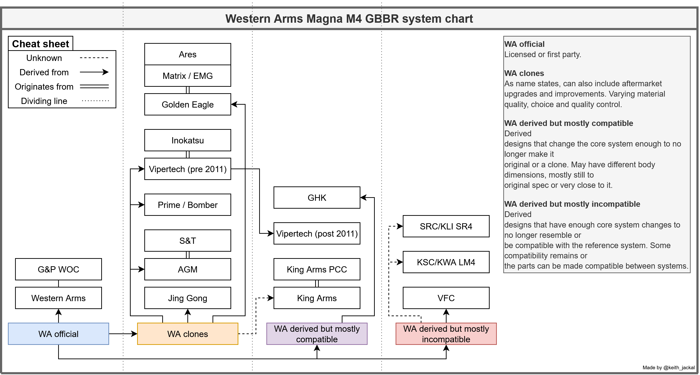

# Western Arms Magna M4 GBBR

<mark style="background-color:$primary;">Western Arms or also known as WA is a Japanese toy gun company who specialises in manufacturing various 1911 or even 2011 replicas. The company also pioneered the modern gas in mag AR-15 system in mid 2000s and has seen countless of clones or even derivatives ever since.</mark>

> While a lot of different companies made WA clones at the time, the only company still producing them is Golden Eagle. Going forward most of the information will revolve around the said brand, unless stated otherwise.

<figure><figcaption>
Wildly oversimplified flowchart
</figcaption></figure>

Known region codes

**FRA** - France\
**POL** - Poland\
**JPN** - Japan\
**USA** - United States

Golden Eagle also happens to carry more than M4 replicas. They notably have gas shotguns which are considered a good value and based on Tokyo Marui gas shotgun platform. You probably have also noticed gel blasters as a part of the GBBR catalogue. Those are usually sold in Australia or few other select countries and are otherwise very similar. The model names are identical and may cause some confusion, for the simplicity we've not listed any under the category but will name them here.

* Golden Eagle MC6604
* Golden Eagle MC6618M
* Golden Eagle MC6593MT\*
* Golden Eagle MC6624M\*\*

\*The "MT" marking for this exact model annotates a tan version for some reason. \*\*Sold as a gel blaster as well

Then there are Fxxxx marked replicas as well, those are AEGs and not worth out time anyways. For example:

* Golden Eagle F6618

### Spreadsheet written by

@keith\_jackal

#### Huge thanks to

@fullcacahd for testing various parts \
@old\_man\_sadigh for the majority of our information \
@kraetor for general info \
@captcalvin1 for general info

#### Honourable mentions

@catgutt for detailed information on related parts \
@hrcbridges for the amazing community

You can find us over at the Heavy Recoil Club discord, #wa-spec-m4 channel

[discord.gg/heavyrecoilclub](https://discord.gg/heavyrecoilclub)
