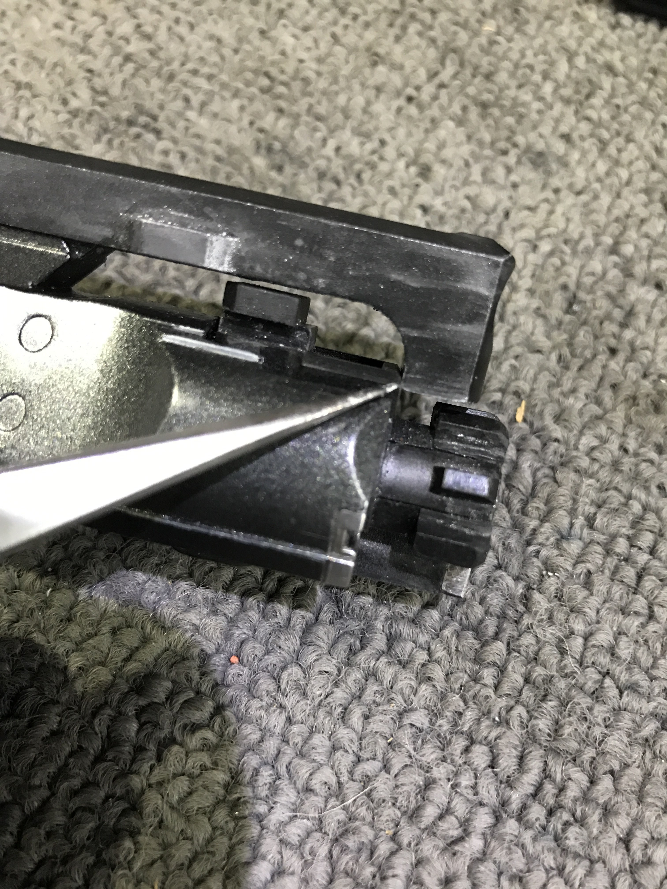
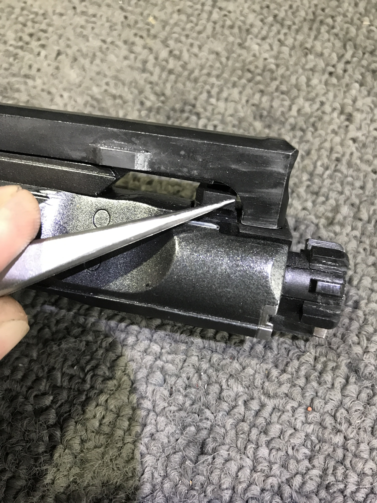

# Charging handle

WA type specific charging handles differ from those found on RS, WE, VFC, ViperTech and GHK. The ‘wings’ need to be removed in order for them to be used in a WA system rifle.

Also, A lot of WA derivative (and those mentioned above) charging handles have the issue of them being impacted by the BCG.

The end hook is often too low so it gets smacked hard by the nozzle on its return to battery, or too thick so it gets hit by either the gas key on the BCG or the fake cam pin on the nozzle.

Look for wear marks in these two areas pictured. If you see wear/impact marks on your charging handle ‘hook’ there’s a good chance material needs to be filed away to prevent this impact from occurring.

The left picture usually only happens when trying to fit a real steel charging handle, the guide wings will need to be removed for most WA type receivers. Most occurrences I’ve found personally are those impacts shown in the right picture.

In either case, material needs to be removed to prevent premature breakage of your charging handle.

<figure><figcaption>
Unmodified charging handle
</figcaption></figure> <figure><figcaption>
Modified charging handle
</figcaption></figure>

> Credits to @old\_man\_sadigh on HRC discord
