# GHK conversion

<mark style="background-color:$info;">Due to the platform similarities between GHK and WA you can actually convert your WA to take GHK specific fire control group parts (FCG in short).</mark>\
\ <mark style="background-color:$info;">By default with no modifications done you can install a GHK trigger set and hammer with the hammer spring as well, basically drop in. It's considered a good upgrade as you gain a little softer hammer spring with a properly timed firing pin, giving GHK magazines better valve timing and output. This does not affect the functionality with original WA spec magazines, if anything it's an improvement.</mark>


GHK hammer will hit at a full 90 degree angle and with no pivoting firing pin you must have your hammer cocked every time you wish to remove or insert a magazine. WA FCG is designed around the hammer just tapping the firing pin, engaging the valve locker on the magazine until the cycle is done.


Do note that this guide implies you are going to use WA/GHK magazines and not VFC. While VFC mags will work with this conversion they can light strike due to the weaker hammer spring pressure. You've been warned.

## Getting started



This is the GFPA, specific to WA spec and clones.&#x20;

Depending on an exact brand it may differ slightly but generally is the same both functionally and in size.&#x20;

Unlike GHK the firing pin is a part of the set,\
hence the name. the assembly has both a firing pin and bolt catch integrated, making it easy to remove and/or replace if it happens to break.




<figure>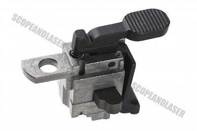<figcaption>
GFPA from a G&#x26;P WOC
</figcaption></figure>

<figure>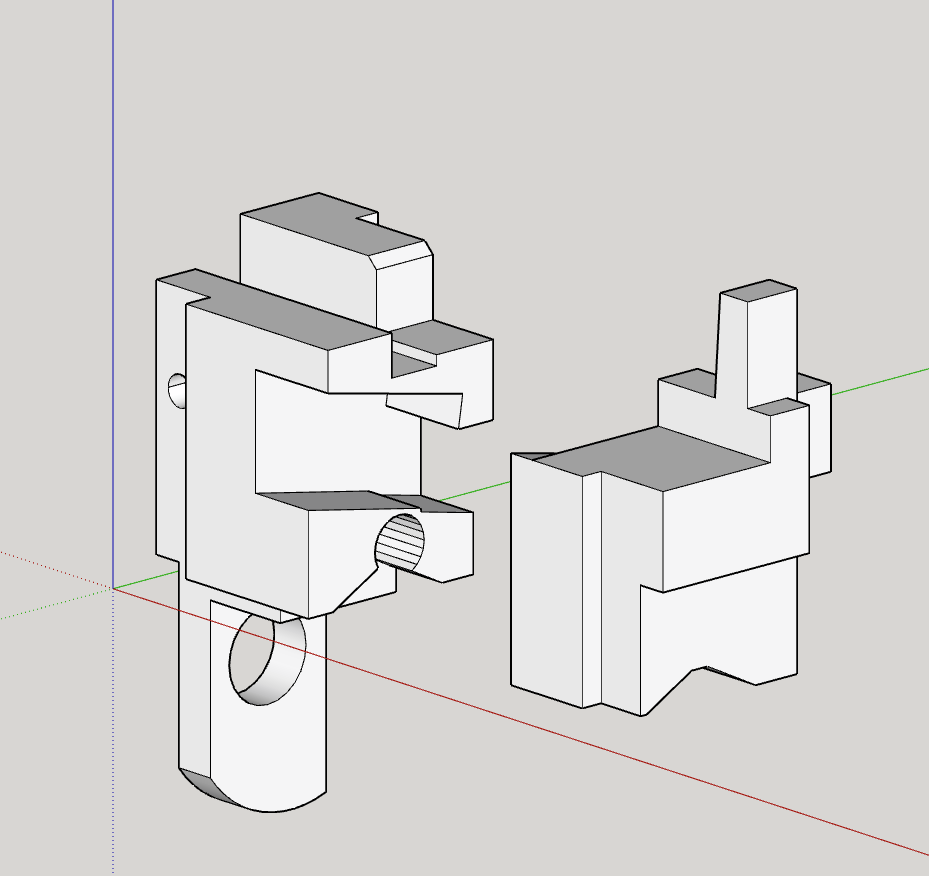<figcaption>
CAD mockup of the WA GFPA
</figcaption></figure>





<figure>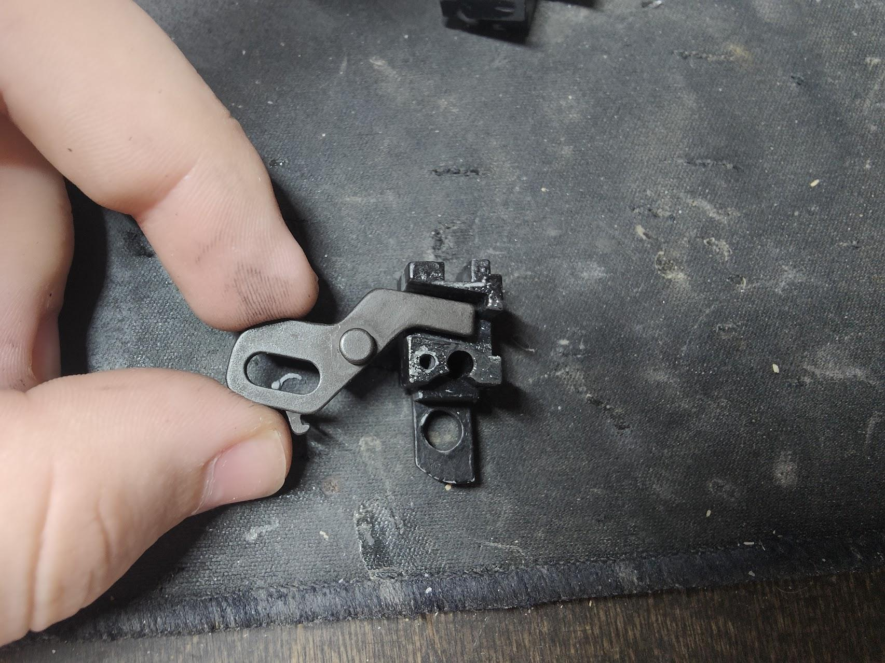<figcaption></figcaption></figure>



Unfortunately the GHK firing pin doesn't even fit through the GFPA, yet alone sit in the lower as is.&#x20;

This is where you must modify the firing pin and GFPA housing to make it all fit properly.



## Cutting the valve knocker



As shown on the picture, use a file to approximately shave the firing pin down as much, you can polish the surfaces and round off any sharp edges if you wish.



<figure>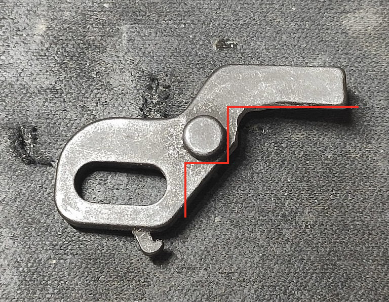<figcaption></figcaption></figure>



If you've done it right the hammer should prop up to a 90 degree angle at minimum without the GFPA being installed. At this point you can reinstall the magazine catch and test fire your rifle

<figure>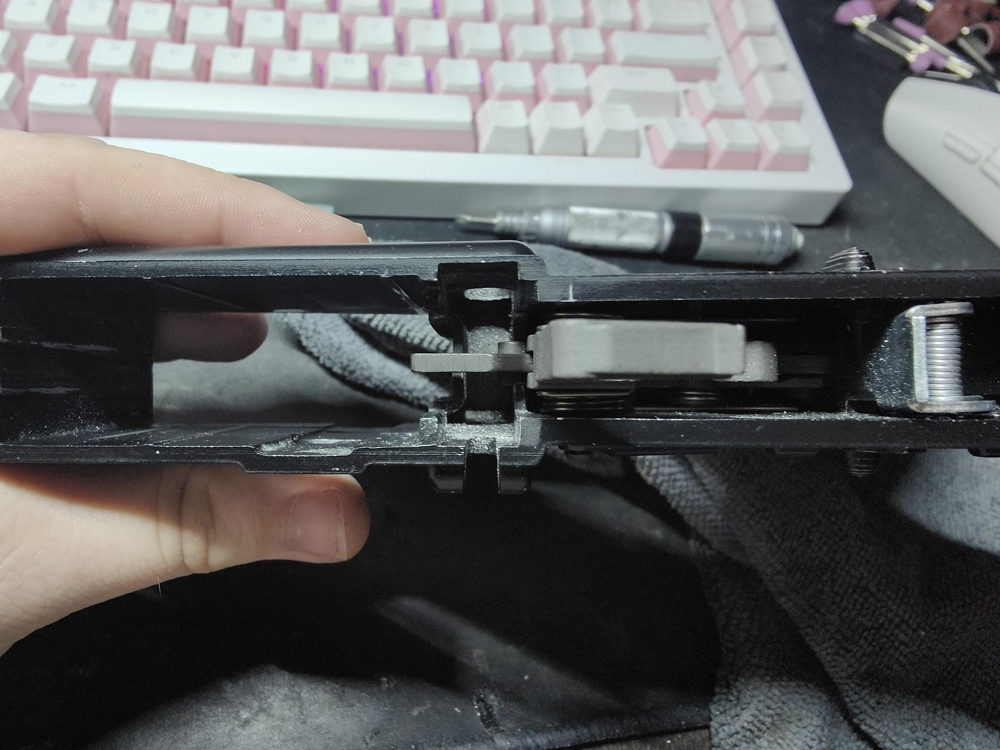<figcaption></figcaption></figure>

DO NOT CUT OFF THE LUGS ON THE SIDES!!!

## Modifying the GFPA


Note! This modification is permanent! If you wish to keep your original GFPA there's a non destructive way by 3D printing a ready made replacement.

[https://cults3d.com/en/3d-model/game/wa-m4-gbb-gfpa-for-ghk-fcg](https://cults3d.com/en/3d-model/game/wa-m4-gbb-gfpa-for-ghk-fcg)


Now it's time to cut up the GFPA, use a good set of files for this!



For an easier understand we'll be using a CAD model for reference with a real piece as an example.

You can start off by separating the halves, cleaning them from grease and ideally marking down your edges. On the model all of the material you should cut away are marked as red.



<figure>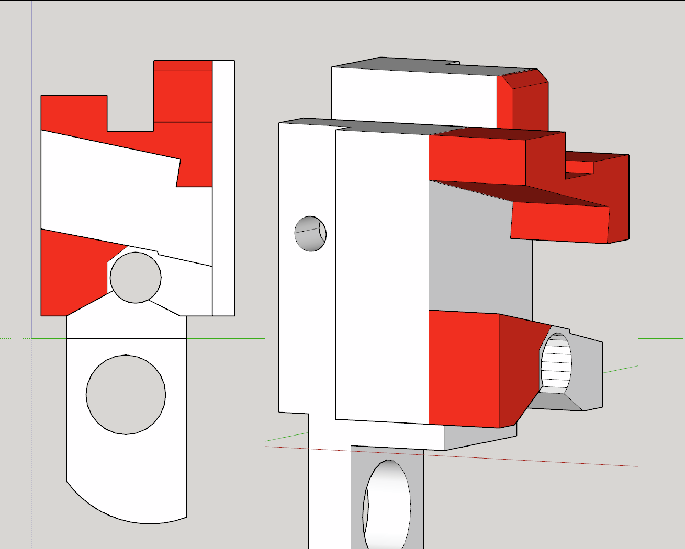<figcaption></figcaption></figure>




{% column width="50%" valign="middle" %}
<figure>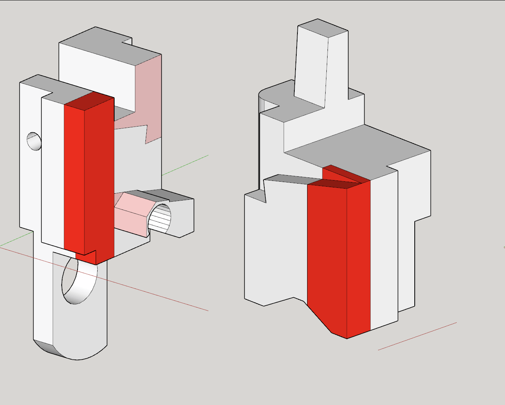<figcaption></figcaption></figure>

<figure>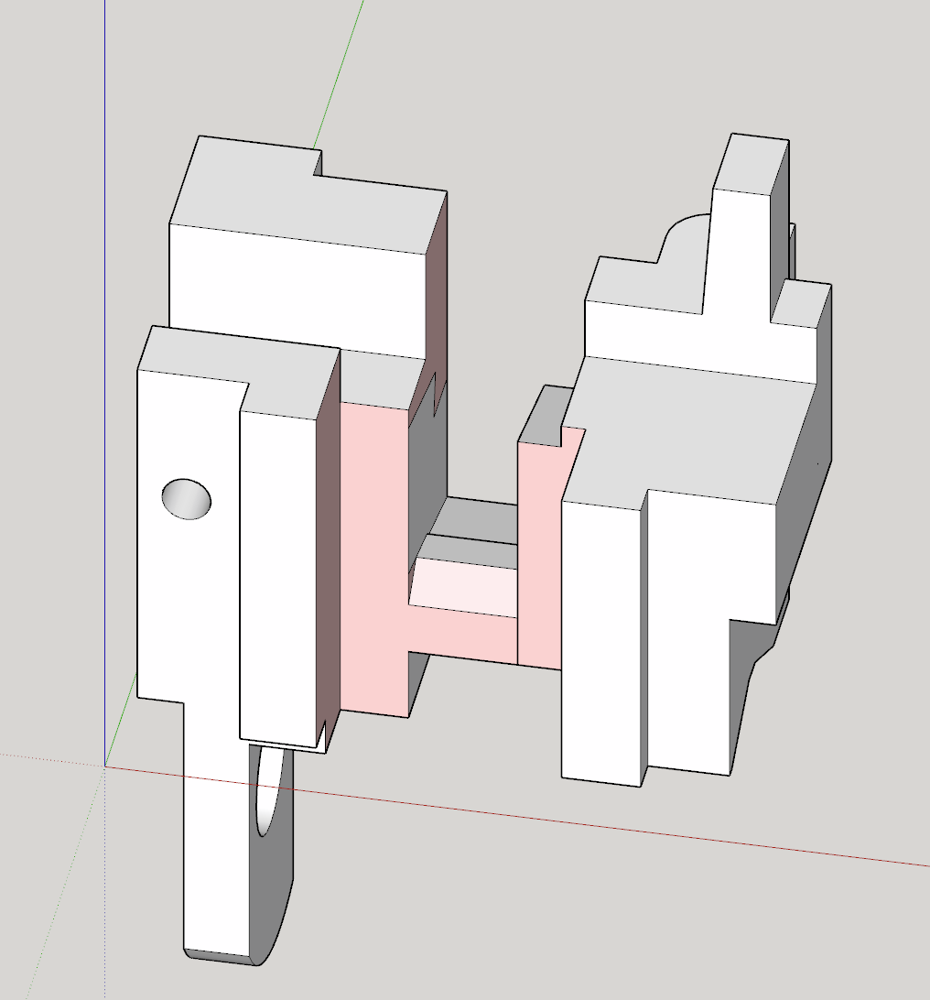<figcaption></figcaption></figure>


{% column width="50%" valign="middle" %}
As a tip, if you can't retain the remaining thin wall you can plug the hole with the bolt catch pin by switching it around with the spring. It's safe to do so.

Next up you have to cut out channels for the firing pin lugs. This is an important and final step. I hope you didn't lose the right half of the GFPA.




{% column width="50%" valign="middle" %}
<figure>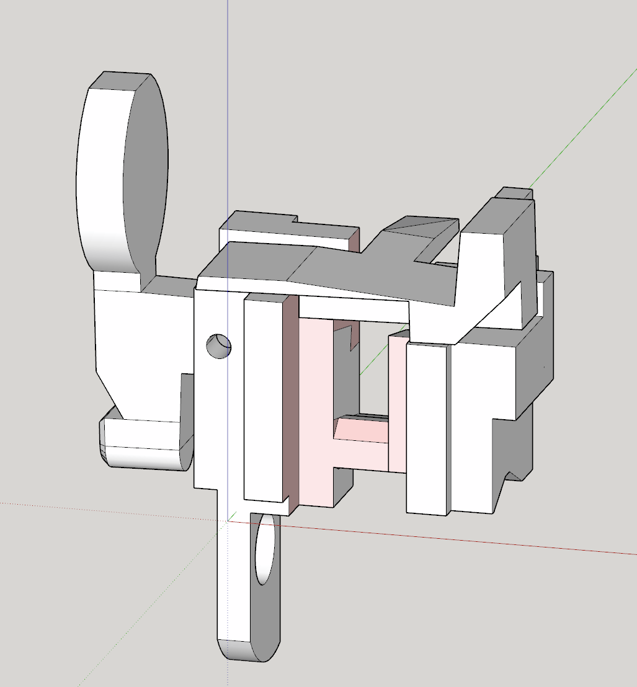<figcaption></figcaption></figure>

Once cut properly it should look similar to this


{% column width="50%" %}
<figure>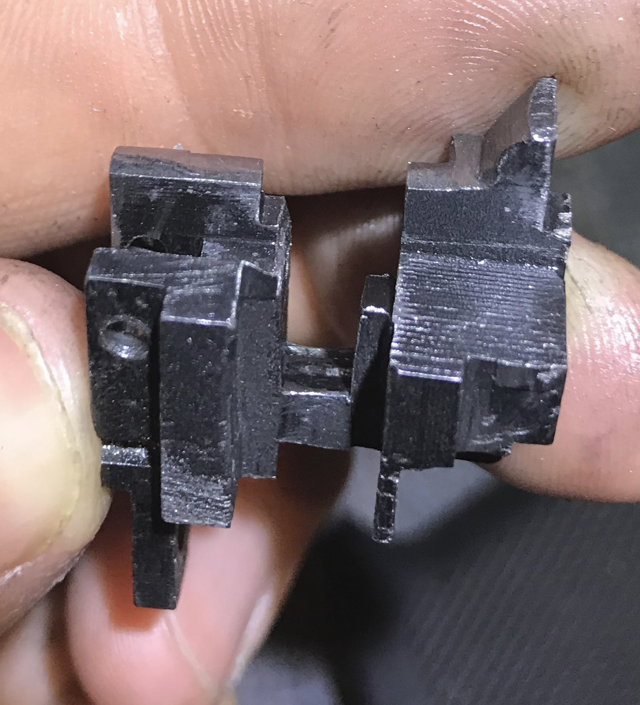<figcaption></figcaption></figure>



## Final touches

Test the fitment, once right you can complete the assembly.

<figure>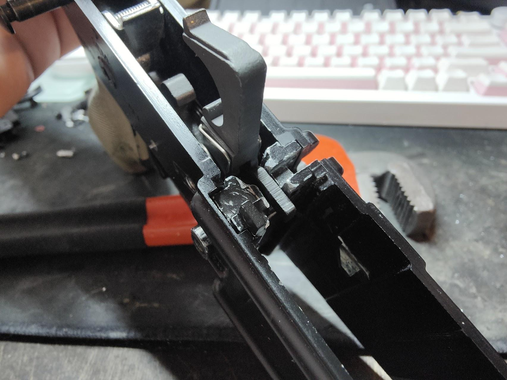<figcaption></figcaption></figure> <figure>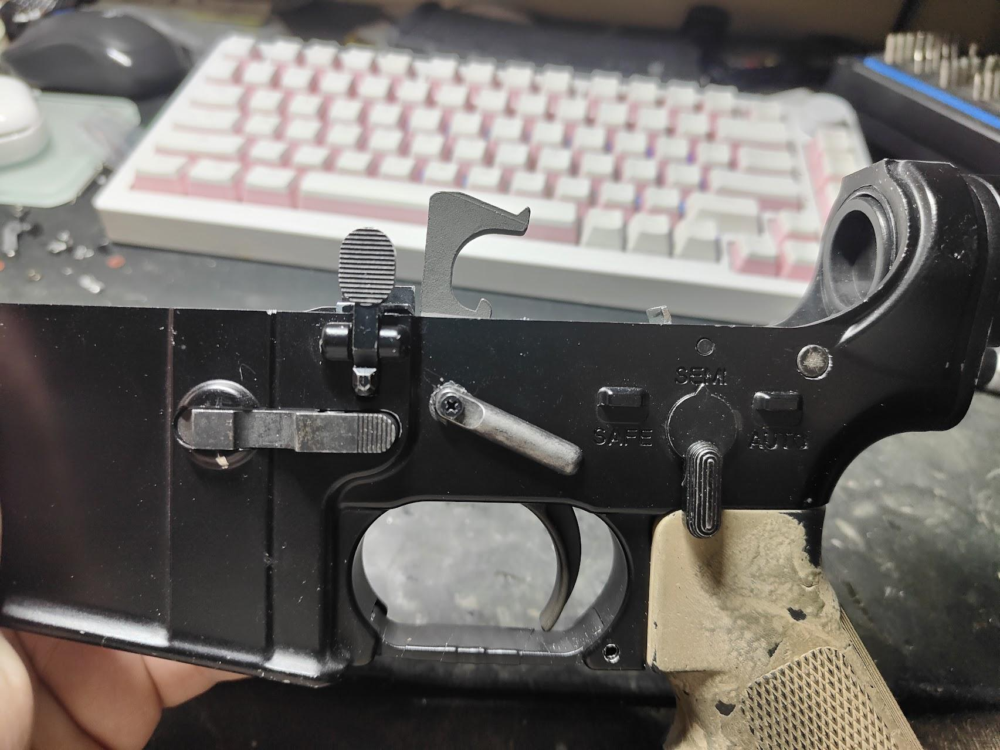<figcaption></figcaption></figure>

