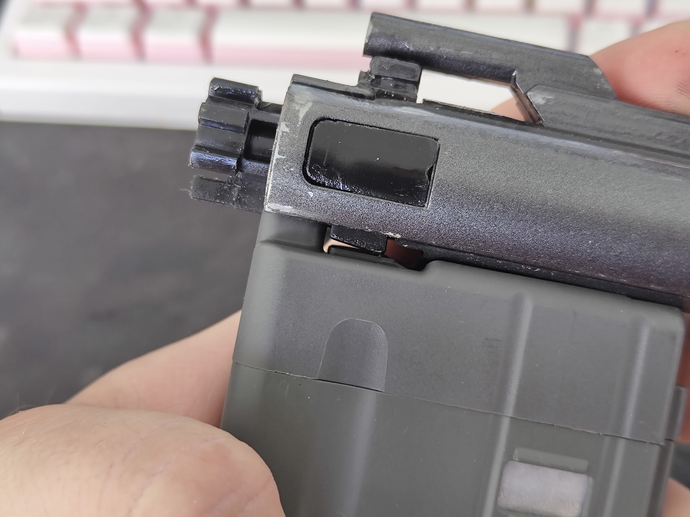
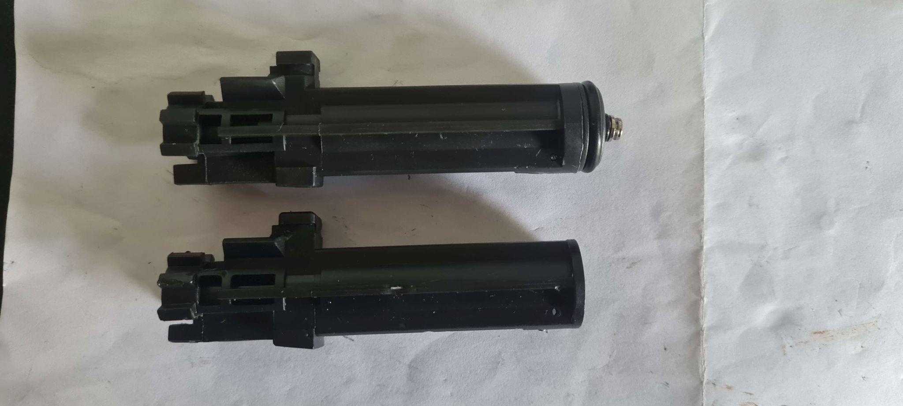
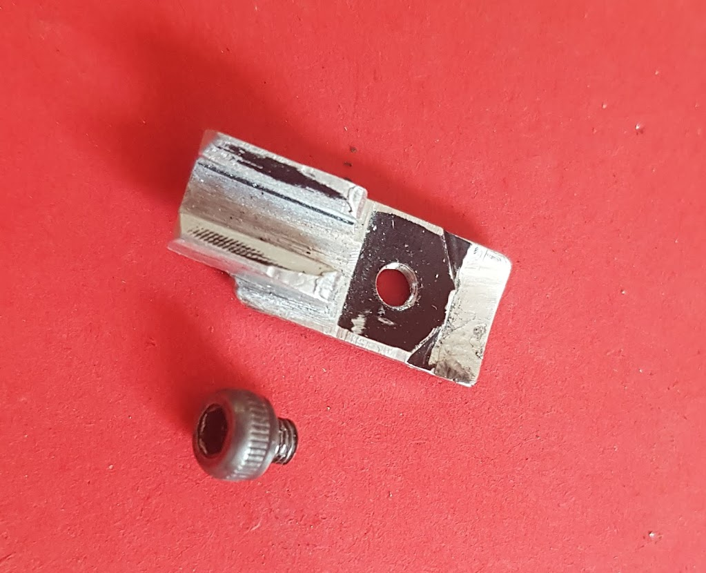

# Loading nozzle


{% column width="33.33333333333333%" valign="middle" %}
Got a Golden Eagle and wish to run standard WA/GHK mags with a stock nozzle?

This modification is quite simple but permanent, filing the nozzle flat will most definitely compromise seal with GE routers on GE mags.

Wish to not do this and instead opt for a whole bolt carrier group swap? Check the next page for more information


{% column width="66.66666666666667%" %}
<figure><figcaption>
Golden Eagle nozzle on top of a VFC V3 magazine
</figcaption></figure>

<figure><figcaption>
Flat nozzle on top, GE below
</figcaption></figure>



<figure><figcaption>
Modified nozzle inside the bolt carrier
</figcaption></figure> <figure><figcaption>
Modified flat nozzle on top of a VFC V3 magazine
</figcaption></figure>

## Adjustable power in a stock nozzle

This is possible and was done way back in the day, problem is getting the actual parts themselves.\
Your only real option is a 3D printed nozzle core replacement.



## Retrofitting a different nozzle

Getting WA spec nozzles may be a bit difficult if not expensive, what about alternatives? Good news is GHK V3 nozzles can actually be made to fit, given you also modify the locking plate.

<figure><figcaption>
Modified nozzle locking plate to use GHK nozzles
</figcaption></figure>

VFC nozzles are a no go, WA spec has the fake cam lug as a part of the loading nozzle with a locking plate on the side. While it will fit into the bolt carrier there's no way to align it without some serious modifications. Not worth it at all.



<figure><figcaption></figcaption></figure>

VFC nozzle above, from a glance it looks like it may just fit.



<figure><figcaption></figcaption></figure>

Less material on top? Looks just perfect.



<figure><figcaption></figcaption></figure>

Locking plate will not fit in without some serious permanent mods to parts.



<figure><figcaption></figcaption></figure>

And it won't work the other way around as well...


