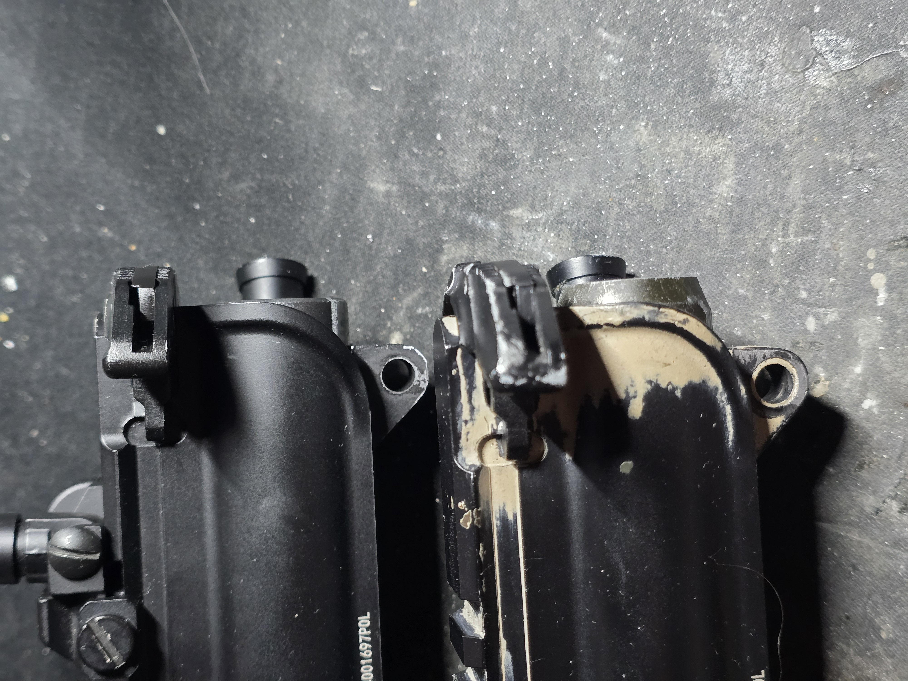
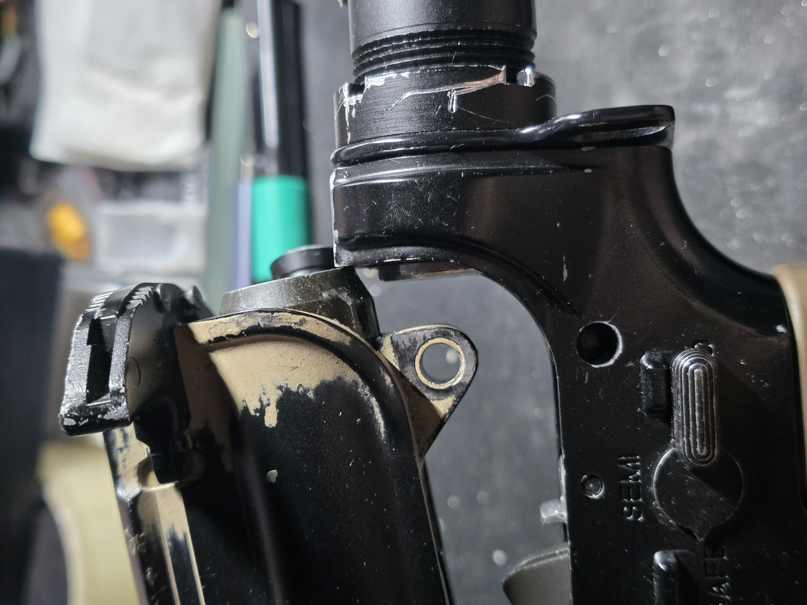

# VFC/GHK BCG

Hard to source replacements, want something fancier or just NPAS without any extra fuss? Bolt carrier group (BCG in short) swap would be an ideal upgrade. In short this is extremely easy.

<figure><figcaption>
WA BCG on top, VFC BCG below
</figcaption></figure> <figure><figcaption>
Bit of a pickle
</figcaption></figure>

Right, maybe not quite drop in and use, that is if you pivot the upper back down in the usual field strip manner. Now your options include filing the BCG shorter from the back or simple undoing both receiver pins. Being a bit longer is not an issue at all.

### What are the benefits?

* More modern nozzle design
* Adjustable power (NPAS)
* Easier source of replacement parts
