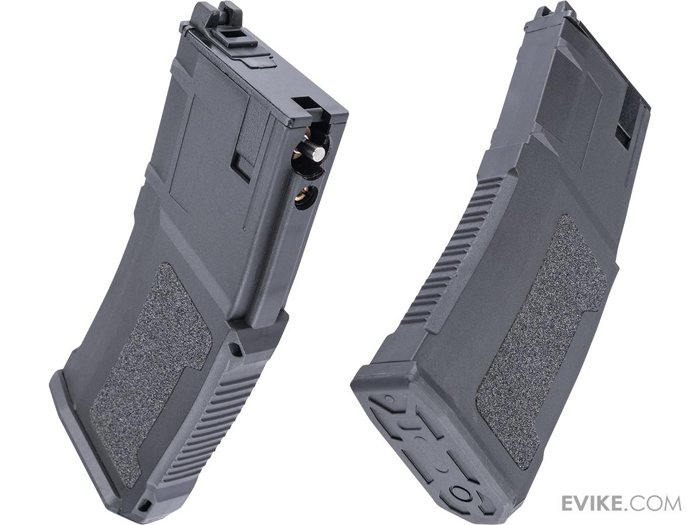
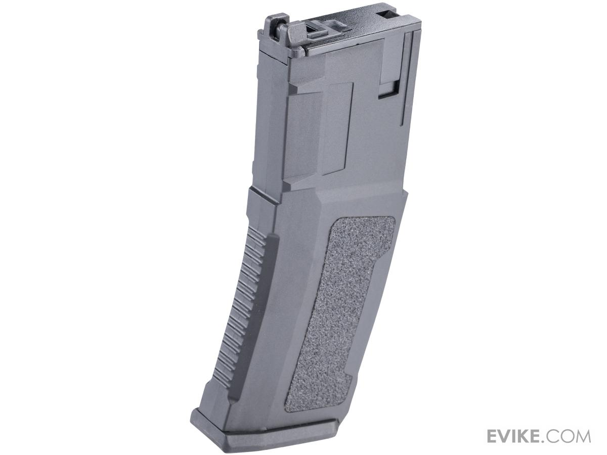
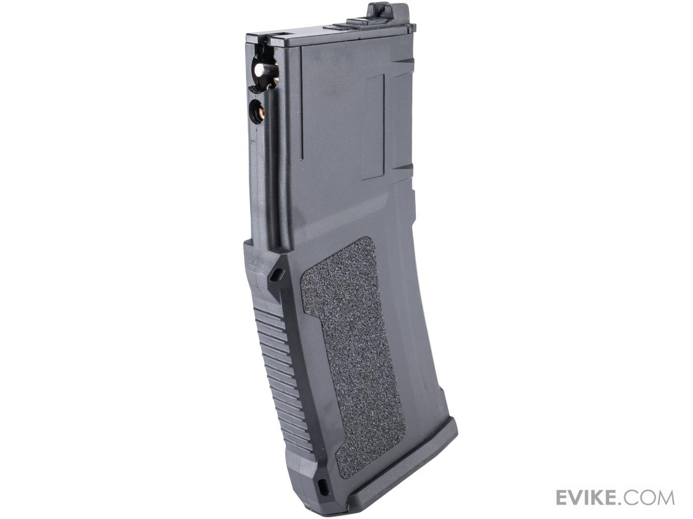

# Golden Eagle ATR4

These mags are a clone of the GHK GMAG with a custom shell and interchangeable between WA spec, derivatives and GHK rifles.\
Note that these mags have a flat router, making them not drop in with existing stock GE rifles. Nozzle must be flat.\
\
These magazines are otherwise equivalent to the PMAG.\
\
Does not support DH or CO2, don't even attempt.

<figure><figcaption></figcaption></figure>

<figure><figcaption></figcaption></figure>

<figure><figcaption></figcaption></figure>
