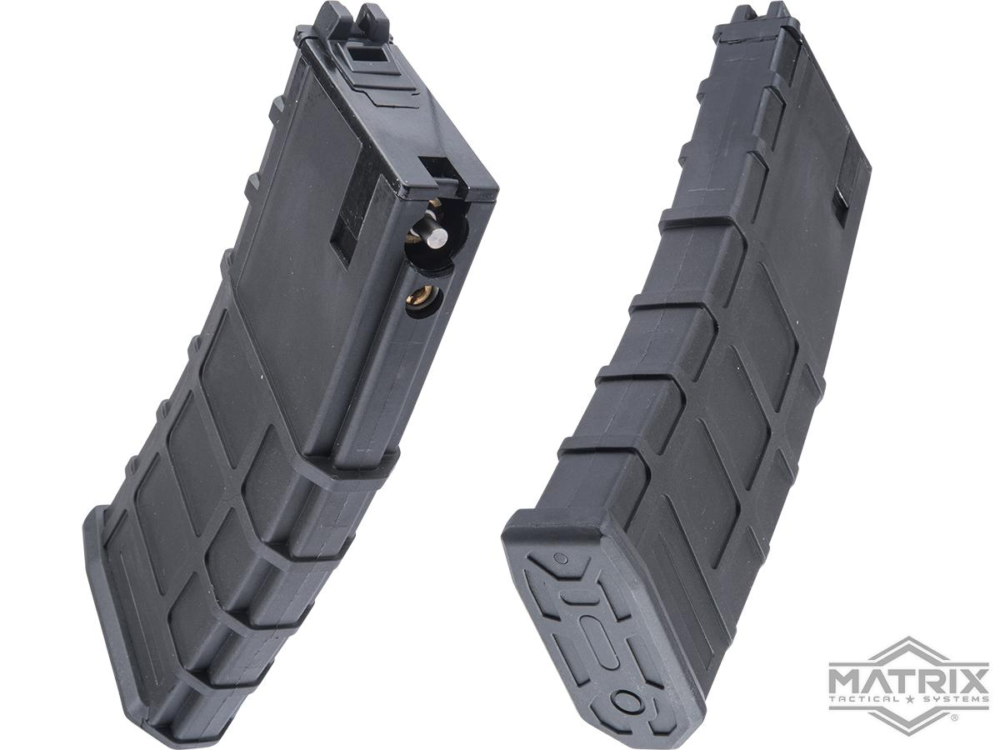
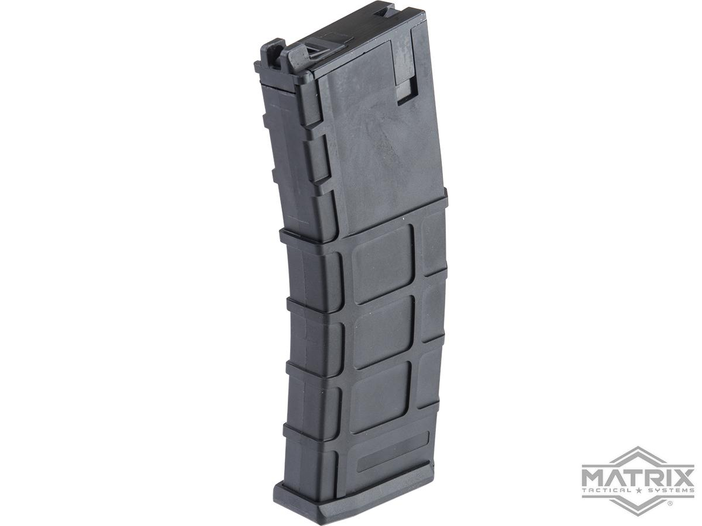
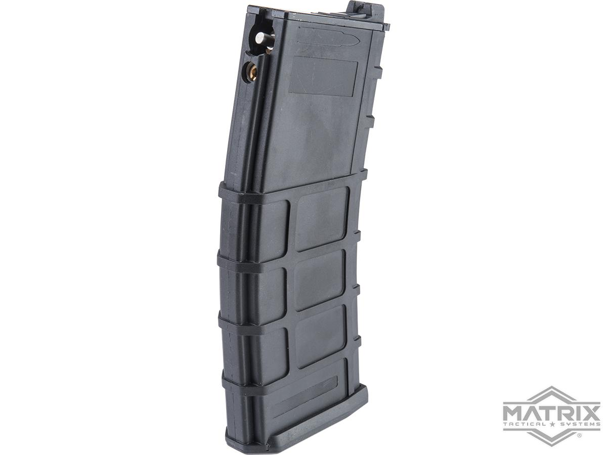

# Golden Eagle PMAG

These mags are a clone of the GHK GMAG and interchangeable between WA spec, derivatives and GHK rifles. Note the GE versions have an angled router.\
These magazines are a great option if you don't want to mod the gun at all.\
\
Does not support DH or CO2, don't even attempt.

<figure><figcaption></figcaption></figure>

<figure><figcaption></figcaption></figure> <figure><figcaption></figcaption></figure>

