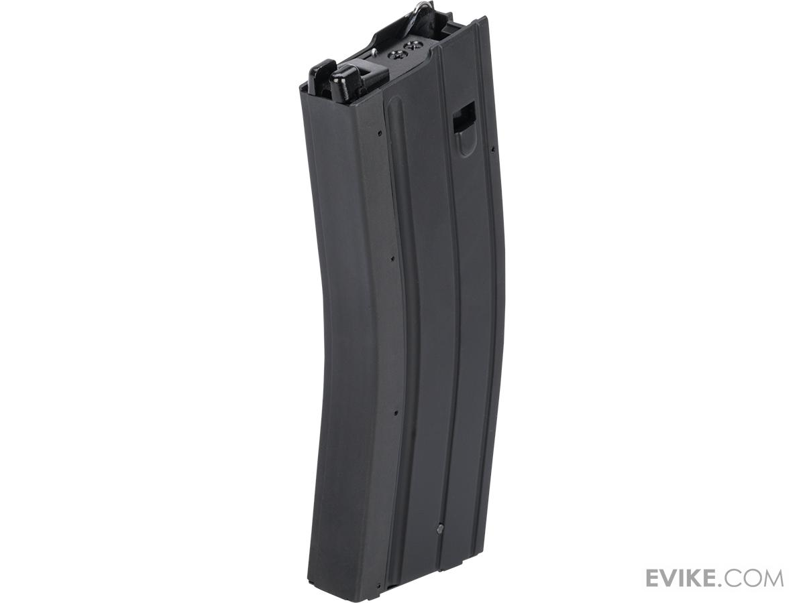
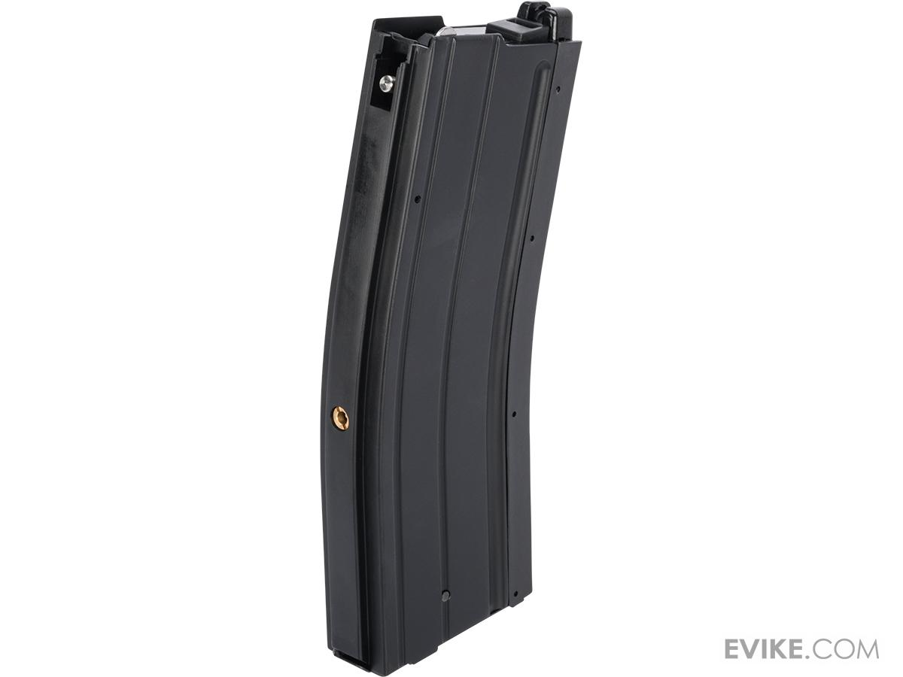

# Golden Eagle STANAG

These magazines are a clone of the original Western Arms design and inherently also complex in design with proprietary gaskets and pins for pressure bearing. The mounting holes eventually stretch out and the magazine won't ever seal again. They're also hard to maintain and weigh a lot.\
\
It's best to avoid these at all costs and either buy PMAGs, GHK magazines or convert for VFC.\
\
DO NOT BUY THESE!!!

<figure><figcaption></figcaption></figure>

<figure><figcaption></figcaption></figure>
