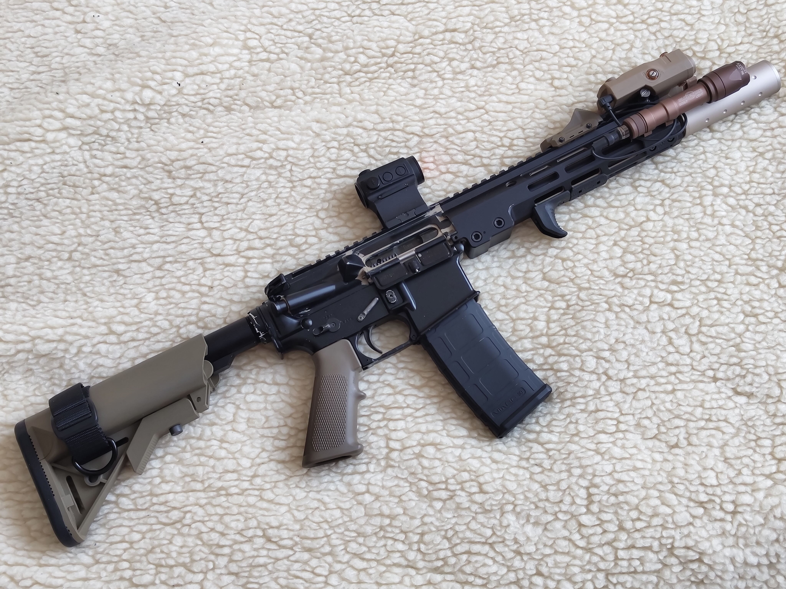
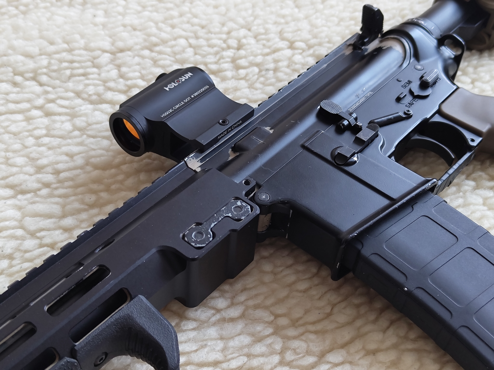
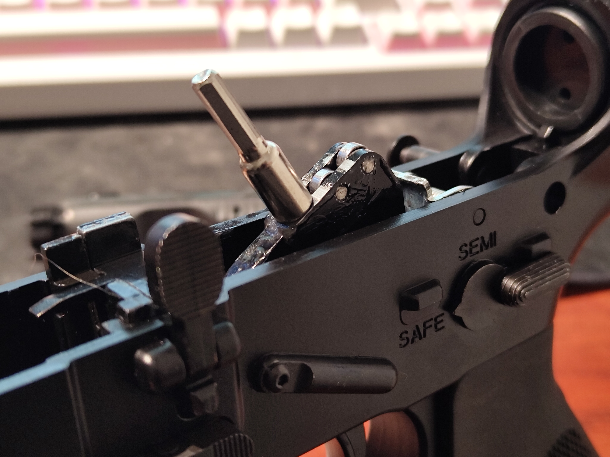
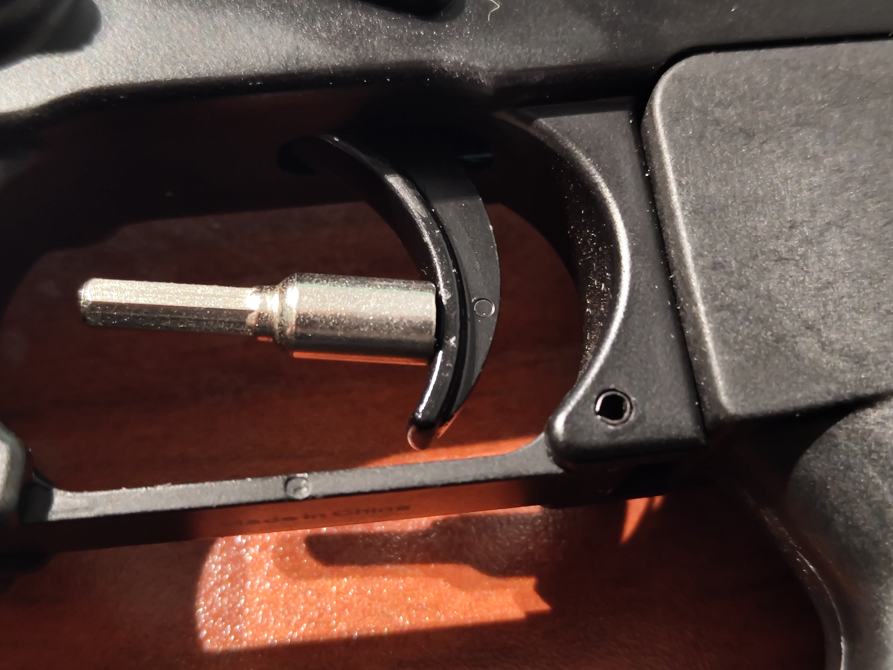
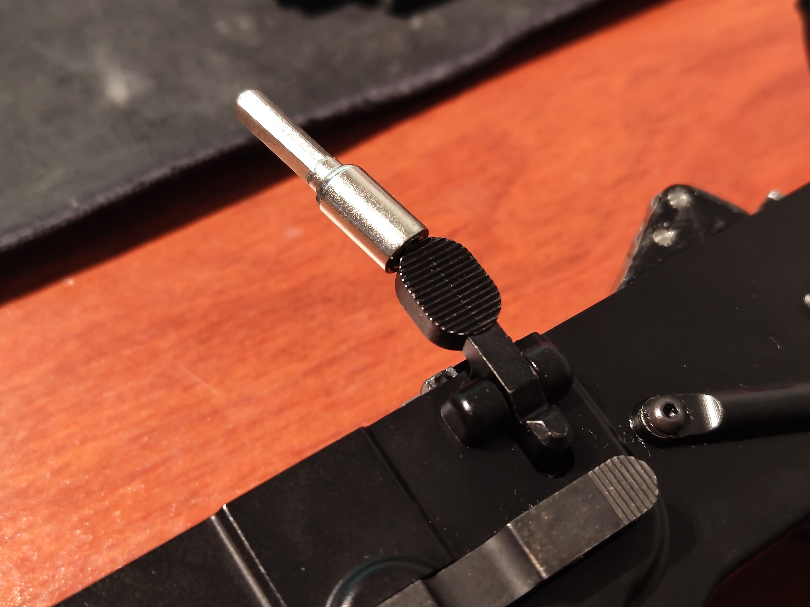
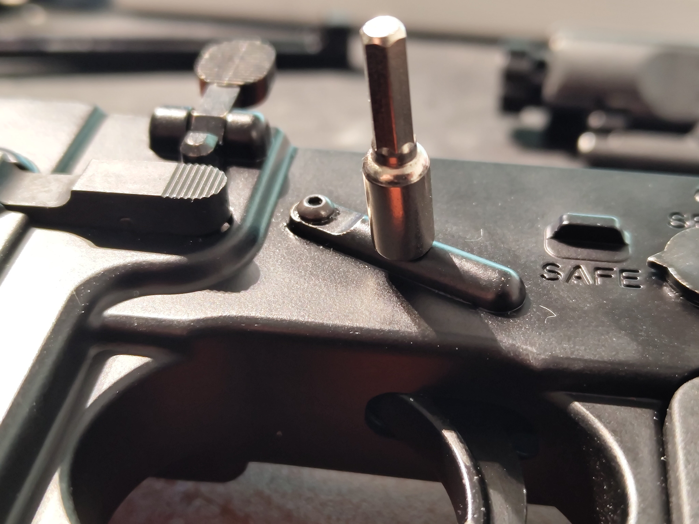

# Metal receiver models

<table><thead><tr><th width="158">Component</th><th>Type</th></tr></thead><tbody><tr><td>Hammer</td><td>Steel, generally with hardened steel bearings</td></tr><tr><td>Trigger</td><td>Steel</td></tr><tr><td>Bolt catch</td><td>Steel</td></tr><tr><td>Disconnector</td><td>Aluminium zinc alloy</td></tr><tr><td>Hop up</td><td>Aluminium zinc alloy - AEG spec Polymer - GBB spec*</td></tr><tr><td>Fire mode selector</td><td>Steel</td></tr><tr><td>Firing pin (valve knocker)</td><td>Aluminium zinc alloy</td></tr><tr><td>Anti rotation pins (if present)</td><td>Steel</td></tr><tr><td>Magazine catch</td><td>Steel</td></tr><tr><td>Receiver pins</td><td>Steel</td></tr><tr><td>Nozzle</td><td>Polymer</td></tr><tr><td>Buffer</td><td>Polymer with zero weights</td></tr></tbody></table>

<figure><figcaption></figcaption></figure> <figure><figcaption></figcaption></figure>



<figure><figcaption></figcaption></figure>



<figure><figcaption></figcaption></figure>



<figure><figcaption></figcaption></figure>



<figure><figcaption></figcaption></figure>



### Important notes

* The hop up may need some work but is generally effective and decently compatible with AEG rubbers and inner barrels.\
  Newer models come with a GBB spec hop up.
* Steel parts are actually steel and well made, some pieces like the trigger and hammer are of higher grade than for example magazine catch. This may point towards multi sourcing a machine shop.
* Anti rotation pins are useful but you need to threadlock the screws, ideally replace them too.
* Receiver wobble isn't a huge deal but can be fixed by the usual means if yours has any.
* For parts compatibility please refer to our compatibility section. Metal receiver guns typically ship with the PMAG but it seems to be a widely optional spec.
* You want to replace the stock buffer with a real one or any proper airsoft equivalent.
* While the internals are mostly steel a very important part isn't, the disconnector. Not the end of it as you can replace it easily and it's not prone to excessive wear and tear in a long term. The auto sear will most likely break first

### Verdict

While generally played down on, and sometimes for a good reason, these rifles should not be ignored as potentially great string budget options. The platform still offers massive potential and really wide parts compatibility, from furniture down to internal parts and magazines!\
The metal receiver models are pretty decent as is and perform exceptionally well for a cheap clone of a \~20 year old system. Granted, these clones are basically derived at this point by including a bunch of minor changes and improvements over the original.

Price wise they're as cheap as 160 euros at times but go up to around 320-350, depending on where you buy these from. Notably the MC6595M (Mk16 URGI) constantly retails for around 200-240 euros or 270-320 for a MC6592M (Mk18 DD). Do make sure you get the most recent batch and ensure it comes with a PMAG!\
Getting the most recent batch isn't mandatory but they do have better feeling exterior quality, if that's what you care about.

And of course, you as the end user, should make the final decision. While there is plenty of potential and good things going for it you might be fine spending more for a much newer/better system. That's a call you will make.

