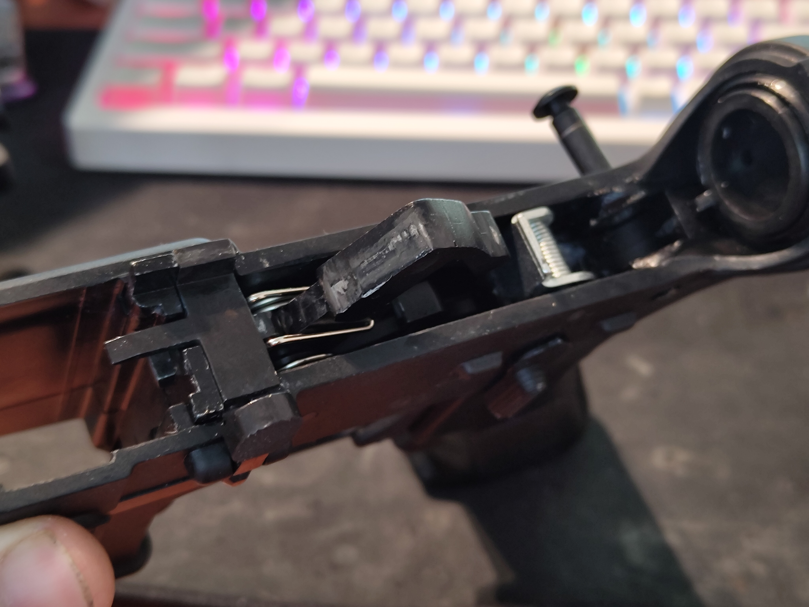
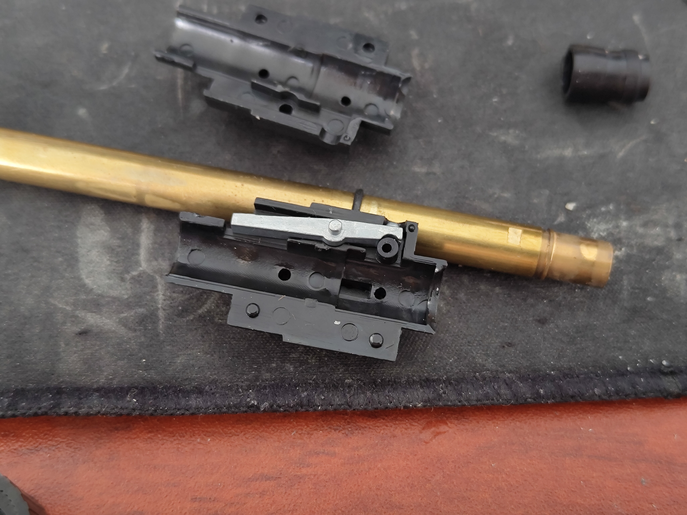

# Polymer receiver models

<table><thead><tr><th width="158">Component</th><th>Type</th></tr></thead><tbody><tr><td>Hammer</td><td>Aluminium zinc alloy</td></tr><tr><td>Trigger</td><td>Aluminium zinc alloy</td></tr><tr><td>Bolt catch</td><td>Aluminium zinc alloy</td></tr><tr><td>Disconnector</td><td>Aluminium zinc alloy</td></tr><tr><td>Hop up</td><td>Aluminium zinc alloy - AEG spec Mix - WA spec</td></tr><tr><td>Fire mode selector</td><td>Aluminium zinc alloy</td></tr><tr><td>Firing pin (valve knocker)</td><td>Aluminium zinc alloy</td></tr><tr><td>Anti rotation pins (if present)</td><td>-</td></tr><tr><td>Magazine catch</td><td>Aluminium zinc alloy</td></tr><tr><td>Receiver pins</td><td>Aluminium zinc alloy</td></tr><tr><td>Nozzle</td><td>Polymer</td></tr><tr><td>Buffer</td><td>Polymer with zero weights</td></tr></tbody></table>

<figure><figcaption></figcaption></figure> <figure><figcaption></figcaption></figure>

### Important notes

* These either ship with the old WA spec hop up setup or the newer AEG spec setup, refer to notes above
* Lacks steel in places that matter so the system wears down significantly quicker, and just isn't very durable
* Lack of anti rotation pins isn't the end of the world as these teeth into the polymer and use a washer clip
* Polymer receivers are not good and with the upper especially there's quite a bit of friction
* The polymer versions still ship with STANAGs
* Fire selector and magazine catch are also zinc alloy but not major wear parts

### Verdict

Oh boy... Yes these are cheap and they do work. We strongly advise against buying the polymer models at all cost. The downgrades are severe enough with not a steep enough price drop. The main benefit is the price but honestly it just isn't worth the pennies saved, unless you need a parts gun or just a backyard toy.\
Granted, the polymer models can be as cheap as 100 euros (yes you read that right) and up to about 180 euros. They do come with decent quality handguards and some other bits and serve as perfect donors. Outside of this they don't really perform all that great and can have severe enough receiver flex which can bind up the bolt carrier. Not to mention a lack of steel where you want it to be.

<mark style="color:$danger;">**Do not buy!!**</mark>

